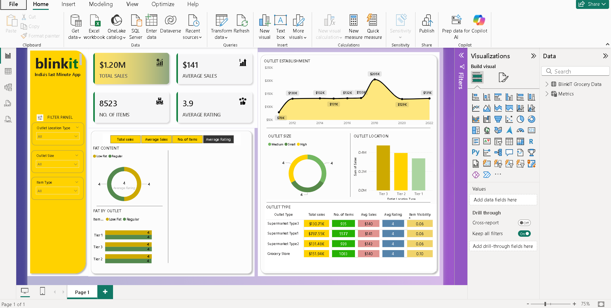

# 🛒 Blinkit Sales Analysis Dashboard – Power BI  

An **interactive Power BI dashboard** built on Blinkit sales data, providing insights into **sales performance, customer preferences, outlet characteristics, and product categories**.  

---

## 📸 Dashboard Preview  
  

---

## 📌 Project Overview  
This dashboard transforms **Blinkit sales data** into **actionable insights** for business decision-making.  
It enables stakeholders to:  
- Monitor **overall sales performance**  
- Analyze **outlet and product trends**  
- Compare **item types, fat content, and location performance**  
- Identify **key drivers of sales and revenue**  

---

## 📊 Dashboard Features  

### 🔹 KPI Highlights  
- **Total Sales**  
- **Average Sales per Item**  
- **Total Number of Items Sold**  
- **Average Rating**  

### 🔹 Product Insights  
- **Fat Content Analysis** (Donut Chart) – Low Fat vs Regular  
- **Item Type Distribution** (Stacked Column Chart)  

### 🔹 Outlet Insights  
- **Sales by Outlet Location Type** (Treemap)  
- **Sales by Outlet Size** (Donut Chart)  
- **Sales Trend by Establishment Year** (Line Chart)  
- **Outlet Type Summary** (Matrix with KPIs: Sales, Items, Avg. Sales, Avg. Rating, Visibility)  

### 🔹 Interactivity  
- **Slicers/Filters** for:  
  - Outlet Location Type  
  - Outlet Size  
  - Item Type  

---

## 🛠️ Tech Stack  
- **Tool**: Microsoft Power BI  
- **Data Processing**: Power Query  
- **DAX Measures**: For KPIs (Total Sales, Avg. Sales, Item Count, Avg. Rating)  
- **Visuals Used**: KPI Cards, Donut Charts, Column Charts, Treemap, Line Chart, Matrix, Slicers  

---

## 🚀 How to Use  
1. Clone or download this repository.  
2. Open the `.pbix` file in **Power BI Desktop**.  
3. Explore the dashboard by applying filters and slicers.  
4. Gain insights from sales, outlet, and product perspectives.  

---

## 👨‍💻 Author  
**Srijan Roy**  
📌 Data Enthusiast | Power BI Learner | Dashboard Creator  
